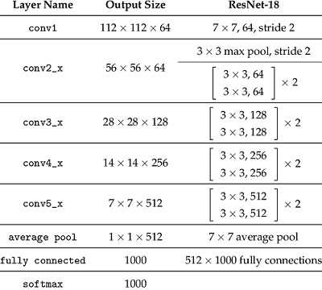
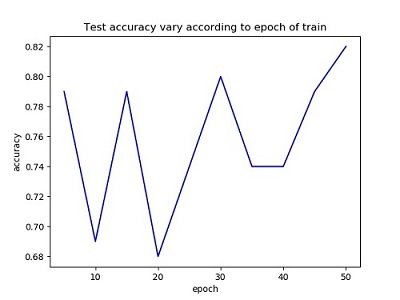
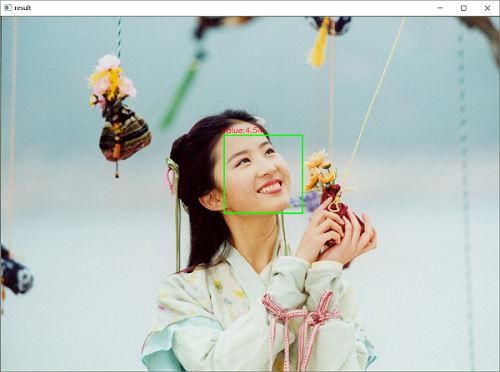

# isBeauty
```
Facial Beauty Predictor based on SCUT-FBP5500-Database, If the predict result is not ideal, just take it as a joke~
Everybody is beautiful/handsome~~~
You can star this repository to keep track of the project if it's helpful for you, thank you for your support.
```

# Introduction
#### in Chinese
https://mp.weixin.qq.com/s/5eVFPMiFA8VhYYlTHlNh1A

# Environment
```
OS: Ubuntu16.04(train)/Windows10(test)
Graphics card: Tian XP(train)/1050Ti(test)
Python: Python3.5+(have installed the neccessary dependencies)
```

# Model Structure
#### baseline

#### some changes
```
Remove the softmax and change the output size of FC(1000 → 1).
```

# Usage
#### Train
```
Firstly, download the dataset from https://github.com/HCIILAB/SCUT-FBP5500-Database-Release.
Secondly, modify the config.py according to your needs.
Finally, run:
python train.py
```
#### Test
```sh
usage: predict.py [-h] [-i IMAGE] [-m MODEL]

Facial beauty predictor.

optional arguments:
  -h, --help  show this help message and exit
  -i IMAGE    Image to be predicted.
  -m MODEL    The model path of facial beauty predictor.

cmd example:
python predict.py -i testPic/test.jpg -m weights/epoch_50.pkl
```

# Result
#### train

#### test


# More
#### WeChat Official Accounts
*Charles_pikachu*  
